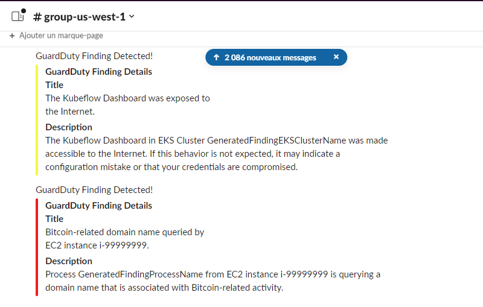

# Solution : GuardDuty Alerting in Slack - Mini Project

## Project Overview
This project is a serverless application that sends GuardDuty findings to Slack. It uses AWS Lambda to process GuardDuty findings and sends them to Slack using a webhook.

## Task1

 - First, in order to establish a communication. I created the `gd-notify` topic so that i can receive simulated findings triggered from the GuardDuty in the specified channel.
 - Second, I created a Cloudwatch rule to monitor GuardDuty findings and route them to the subscribed SNS topic.
 - Then, I created the Lambda function using Node js runtime to fetch and process the findings received from CloudWatch and send them to the Slack group `group-us-west-1` using the Webhook URL.
 - The notification will showcase the title and the description with an associated color reflecting the degree of severity as is it more meaningful to the `Security Team`. Here is an example :

### My lambda function `gd-notify-rayane`
- First, the handler functions is exported as the entry point of the code to be fired. Obviously it would be asynchronous since it handles many HTTP requests.
- We Check if the event contains any records, if so we process each SNS record by parsing its content.
- We encapsulate the title, description and the severity color of the finding into one message.
- We stringify the `message` so that all the properties and values within the object are converted to their JSON string representation. This ensures that the payload sent in the HTTP request body is in the correct format expected by the recipient, in this case, the Slack webhook.
- Then, we configure the request by setting up the options that will define the receiver and the method type with some headers. Adding to that a callback function which will handle the received response from the Slack webhook.
- Finally, we  write the payload data to the request body and just send it.

## Task2

For the second task, I chose the `Impact:S3/AnomalousBehavior.Delete` finding which lies about when an IAM entity invoked an S3 API that attempts to delete data in a suspicious way. This type of findings are Highly classified in severity as client data are threatened for deletion. 
Refering to the AWS documentation it turns out that it may occured when the credentials have been exposed or the S3 permissions are not restrictive enough. So to remediate I propose : 
* `To isolate the affected IAM entity` : We should identify and isolate (delete, freeze ..) the IAM entity responsible for the suspicious behavior. This could be a user, group, or role with the necessary permissions to delete S3 data.
* `To revoke access` : We should immediately revoke the IAM entity's access privileges to prevent any further unauthorized deletions. This consist of modifing the IAM policies associated with the entity, removing the permissions necessary for data deletion.
* `A Multi-factor authentication`: Lastly, the MFA security used by facebook and instagram applications. This requires MFA for all IAM entities that want access to the account user, adding an extra layer of security to prevent unauthorized access.
* `A Backup and recovery mechanisms and versioning` : We should make backup evenly to prevent the loss of data, and save different versions of the bucket.
* `To establish a secret phrase for preventive measures (extra for developpers)` : This secret phrase should be personal for every user and hashed in the database. The user must enter it if he really wants to delete the bucket.
